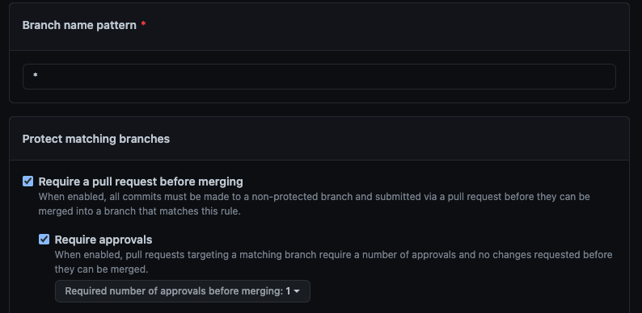

# Car Sharing Service project description
There is a car sharing service in your city, where you can rent cars and pay for your usage using cash, depending on the duration of your rental.
The problem is, the system for tracking cars, rentals, users, and payments in the car sharing service is outdated - everything is managed manually and all records are kept on paper. There is no way to check the availability of specific cars in the service. Additionally, you can only make payments with cash; there is no support for credit cards. The car sharing service administration has no way of knowing who returned the car on time and who did not.

In this project, you will be addressing all these issues. Your task is to implement an online management system for car rentals. This system will streamline the work of the service administrators and greatly enhance the user experience.

## If you work in a team

1. Create an organization on GitHub
   
2. Choose a `Free` plan
3. Use a name like `fe-feb20-team0` (your group + your team name)
4. It should belong to your personal account
   
5. Add your teammates to the team by their usernames on Github
   

## Instructions
1. Create a new Spring Boot project
2. Create a new GitHub repo with `car-sharing-app` name (or any other you like)
   - if you work in a team the repo MUST belong to the organization;
   - configure `Branch protection rules` for the organization repository using the following tutorial:

     

       
Tutorial for branch protection rules

     Go to the repository settings
     STEP #1
     

     STEP #2
     

     Add the rule with only next settings
     STEP #3
     

     More information about all other settings at the [link](https://docs.github.com/en/repositories/configuring-branches-and-merges-in-your-repository/defining-the-mergeability-of-pull-requests/managing-a-branch-protection-rule)
     

3. Connect a repo to a folder with your Spring Boot project (see the instructions on GitHub);
4. Setup checkstyle plugin in your project
5. Setup CI process to run `mvn clean verify` command by adding a `.github/workflows/ci.yml` file
6. The `master` (or `main`) branch is a base for your feature PullRequests.
7. PRs should be merged there after review

## How to develop a feature

1. `Pull` the latest `master`.
2. Create a `your-feature-name` branch and `push` it to GitHub.
3. Open a Pull Request (`PR`) from your branch to the `master` (`main`).
4. Write your code, save it and push it to GitHub.
5. Ask your teammate to review and approve if everything is OK.
6. If some fixes are required discuss the comments and repeat steps 5-7.
7. Mentors will review your codebase everyday, but not PRs.

## App

... TODO: add requirements